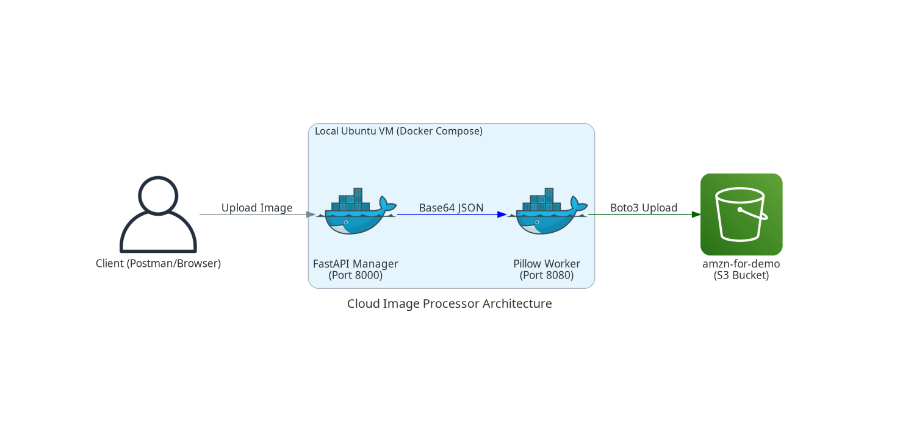

🎨 Cloud-Ready Image Processor

A high-performance, distributed system built with Python and Docker that automatically transforms images into Grayscale and stores them securely in the AWS Cloud.
🏗️ System Architecture

This project uses a "Manager-Worker" pattern to ensure the application stays fast even when processing large files.

## 🏗️ System Architecture

How it works:

    User: Sends an image via Postman or a Web Browser to the Manager.

    FastAPI Manager: Receives the image and passes it to the Worker.

    Pillow Worker: Performs the heavy lifting (Resizing & Grayscale).

    AWS S3: The Worker uploads the final result to the cloud.

🛠️ The Project Toolbox (Libraries Used)

    FastAPI: The "Front Door" of the project. It handles all incoming web requests and ensures the image upload process is smooth and secure.

    Pillow (PIL): The "Engine Room." This library does the actual work of converting your photos to grayscale and resizing them to save space.

    Boto3: The "Cloud Messenger." This is the official AWS library that securely transports your finished images from your Ubuntu environment to the Amazon S3 bucket.

    HTTPX: The "Internal Radio." It allows the Manager and the Worker to talk to each other instantly without making the whole system wait or lag.

    Uvicorn: The "Power Supply." A lightning-fast server implementation that keeps your Python code running and "listening" for new uploads.

🚀 Key Features

    Containerized Workflow: Runs anywhere (Ubuntu, Windows, Mac) using Docker.

    Automated Processing: No manual editing needed; just upload and go.

    Cloud Integration: Files are saved in Amazon S3 for permanent storage.

    Cost Effective: Designed to run on AWS Lambda or small EC2 instances to keep monthly costs near $0.

📦 Use of Containers

We use Docker Compose to run this project. This is better than running scripts manually because:

    Isolation: The Worker cannot crash the Manager.

    Environment Parity: "It works on my machine" is guaranteed for everyone.

    Scalability: If you have 1,000 users, you can simply start 5 "Worker" containers to handle the load.

🔧 Troubleshooting

    ModuleNotFoundError (Linux): On Ubuntu 24.04, you must use a virtual environment. Run source venv/bin/activate before running any Python scripts.

    Connection Refused: Ensure Docker is running by typing sudo docker-compose up.

    AWS Permissions: Ensure your IAM user has s3:PutObject permissions.

🔮 Future Improvements

    Progressive Watermarking: Add a custom logo to every processed image.

    Multi-Filter Support: Add Sepia, Blur, and Contour filters.

    Auto-Cleanup: Set S3 Lifecycle rules to delete temporary images after 24 hours to save money.

    Database Logs: Use PostgreSQL to track which user uploaded which image.
